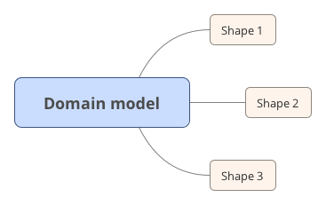

# RAML Typesystem Shapes

**Problem statement**: different use cases require us to expose different representations(shapes) of same business entity. 



One way to model it in `Callable` is [scopes](scopes.md), however some times you need to model different shapes 
of the same model entity as a separate RAML types.

`Callable` supports following alternative approach to modelling different shapes of the model entity:

### Background

Let's say that we have a `Task` data type which models a *Task* business entity   

```raml
Task:
  properties:
    id: integer
    name: string
    description: string
    subTasks: Task[]
```

However when new *Task* is being added in the system we represent it with following RAML type:   

```raml
NewTaskData:
  properties:
    name: string
    description: string
```

Now we need to mark that `NewTaskData` is not conceptually different entity but just a representation of the `Task` data type
in `Callable` this may be done by using `shapeOf` annotation:

This annotation is defined by the following annotation type: 

```raml
shapeOf:
  type: common.RAMLObjectTypeRef  
```

`It is important that both target and value of this annotation may only be pure object types(no unions)`  

so if we would like to mark that `NewTaskData` is the shape of the `Task` we should
update `NewTaskData` to look as in the following example:
 
```raml
NewTaskData:
  properties:
    (callable.shapeOf): Task
    name: string
    description: string
```
### Instance Transformation:

Now let's talk about how callable transforms instance of the `NewTaskData` into the instance of the task: 

We use following algorithm to perform a conversion which is performed for every property 
of source type.

1. If target type has a property with a same name exists: check if the system knows how to transform value of this
property into value of the target property. If transformation is undefined then whole conversion of model instance to 
target instance can not be executed

2. Else if target property has an annotation `property` and this annotation values is the name of the property
of domain class, or qualified name of the property of the source type, then: check if the system knows how to transform value of this
property into value of the target property. If transformation is undefined then whole conversion of model instance to 
shape instance can not be executed

3. If target property value has a default it is initialized into it's default value, if target is an array and if it is a required property 
it is initialized into empty array, if target is has an object type and it is required it is initialized into empty instance of 
target type *(using the same scheme as for property value)*, otherwise it stays undefined.

Value conversion is executed by the following algorithm: 

1. if values have a type with same structural constraints then no conversion is needed
2. If target value is a shape of model property value then conversion from model to shape is executed
3. If target value is a reference to model property value then conversion to reference is executed
4. If the source value is a reference to model property value, then system checks if it is capable to resolve reference to the instance,
   and if there is no possibility to resolve it conversion should abort, otherwise resolved reference should be written to the target property.
4. Otherwise conversion can not be performed and algorithm should abort.

### Examples:

For example lets assume that we convert following instance of `NewTaskData` into instance of `Task`: 

```yaml
name: Buy milk
description: I should buy the milk
```

the result will be 

```yaml
name: Buy milk
description: I should buy the milk
friends: []
```

Now lets look on the following example:

```raml
PersonData:
  (core.shapeOf): Person
  properties:
    name: string
    lastName:
      (core.property): last_name
      type: string

```

In this example `PersonData` property `name` will be inited from Person property `name`, and `PersonData` property
 `lastName` will be inited from `Person` property `last_name`
 
More complex example:

```raml
Task:
  properties:
    id: integer
    name: string
    description: string
    subTasks: Task[]
TaskData:
    properties:
      id: integer
      name: string
      description: string
      subTasks: 
        type: array
        items:
          type: integer
          (shapes.reference): Task.id        
```

in this example `subTasks` property of the `TaskData` will be inited by values of the `id` property of the values `subTasks`
property of the `Task` instance

### Usage

This module exports following typescript functions:

* `transform(instance:any,source:Type,target:Type,referenceResolver?: (v:any,referenceType:Type)=>any): any` - transforms an instance from one representation to another

* `isShapeOf(source:Type, target:Type)` - checks if source type is shape of target type

* `isDomainOf(source:Type, target:Type)` - checks if source type is domain of target type.


